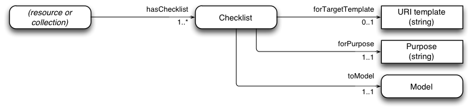
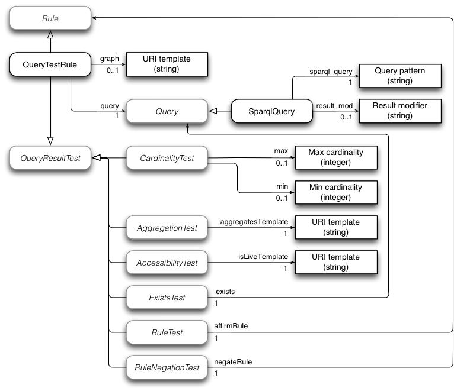
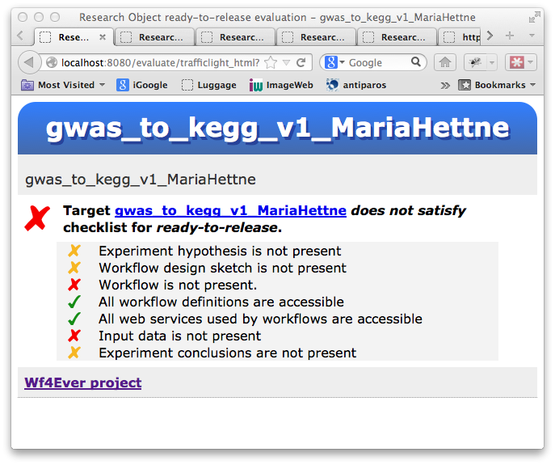

# 4. Checklist-based quality evaluation

Checklists are a widely used tool for controlling and managing quality assurance processes [[CHECKLIST]](#ref-CHECKLIST), and they have appeared in data quality assurance initiatives such as [[MIBBI]](#ref-MIBBI), which deals with coherent minimum reporting guidelines for scientific investigations.  A checklist provides a measure of _fitness for purpose_ rather than some overall measure of quality.  We see this kind of fitness for purpose assessment as being of more practical use than a generic quality assessment, and indeed as the ultimate goal of any quality evaluation exercise.  The suitability of a Research Object for different purposes may be evaluated using different checklists: there is no single set of criteria that meaningfully apply in all situations, which leads to a need to describe different quality requirements for different purposes.  For this purpose, we have defined the Minim model [[Minim-OWL]](#ref-Minim-OWL).

Ideas for minimum information models developed for the [[MIBBI]](#ref-MIBBI) initiative have been adopted and generalized in our [Minim model](#ref-Minim-OWL), which is an adaptation of the MIM model [[MIM]](#ref-MIM), to deal with a range of Research Object (RO) related quality concerns.  Conforming to a minimum information model gives rise to a notion of _completeness_, i.e. that all information required for some purpose is present and available.  In our work, a _checklist_ is a set of requirements on a Research Object that can be used to determine whether or not all information required for some purpose is present, and also that the provided information meets some additional criteria.  

The Minim model was introduced in [[D4.2v1]](#ref-D4.2v1), reflecting its development as of August 2012, but its design and application have substantially progressed since then.  In applying the checklist evaluation capability to myExperiment RO quality display, and other quality evaluations, we have:

- refactored the Minim model, and extended its range of capabilities to meed additional requirements,
- updated the checklist evaluation code to use a SPARQL 1.1 library in place of SPARQL 1.0l, significantly enhancing the expressive capability of the Minim model,
- developed a "traffic light" display of checklist results (for myExperiment integration and other uses),
- developed a REST web service for RO checklist evaluation, and deployed this in the Wf4Ever sandbox,
- created new checklist designs using the Minim model for myExperiment RO quality display, based on scenarios articulated by Wf4Ever project user partners, and
- incorporated checklist evaluation into work on RO stability and reliability evaluation (described below).

We have also started work to evaluate the capabilities of the Minim model applied to a range of quality evaluation scenarios.

<!---
- application of Minim-based checklists to detect workflow decay brought about by withdrawal of KEGG, and confirmation of accuracy of decay detection
- application of Minim-based checklists to other data quality applications described in the literature (chembox, qSKOS) (paper submitted to ISWC in-use track)
-->

The sections that follow describe:

* the Minim data model used to define checklists,
* the Minim results data model used to express the result of a checklist evaluation,
* additional services created to supportpresentation of evaluation results to users of Research Objects,
* the checklist evaluation software structure and its integration with other Wf4Ever project elements,
* some applications that have been created using the checklist evaluation capabilities, and
* ongoing and future work relating to checklist-based quality evaluation.

## Ontological models

A checklist to be evaluated is described by a Minim model, and the results of an assessment are presented using the Minim results model.

### Minim model for defining checklists

This model has been significantly refactored and enhanced since that described in D4.2v1.  The enhancements provide a cleaner structure to the overall model, greater expressive capability (including value cardinality tests similar to those supported my MIM), and clear identification of extension points at which new capabilities can be added to the model.  The refactoring is done so that old-style Minim definitions do not conflict with new style definitions, and both may be supported in a single implementation.

The Minim [ontology](http://purl.org/minim/minim), its [specification](#ref-Minim-spec) and its [OWLDoc documentation](#ref-Minim-owldoc) are maintained in a [GitHub project](https://github.com/wf4ever/ro-manager/tree/master/Minim).

The main elements of the Minim model are:

* __Checklists__ (or Constraints): Different models may be provided for different purposes; e.g. the requirements for reviewing an experiment may be different from those for a workflow to be runnable. A Minim `Checklist` associates a Minim `Model` with a description of the quality evaluation it is intended to serve.

    

* __Models__: a Minim `Model` defines a list of `Requirement`s to be satisfied, which may be mandatory (`hasMustRequirement`), desirable (`hasShouldRequirement`), or optional (`hasMayRequirement`).
* __Requirements__: these denote some requirement to be satisfied by a Research Object, such as the presence of certain information about an experiment, or additional critreria to be satisfied by the available data.  For example, we may wish to test not only that a suitable reference to input data is provided by an RO, but also that the data is live (accessible), or that its contents match a given value (integrity).

    

* __Rules__: a rule is associated with each requirement, and describes how the requirement is tested.  A small number of different rule types are currently supported by the checklist service, including tests of the local computing environment for presence of particular software, and tests that query a Ressearch Object and perform tests on the results obtained.  A rule determines whether a Research Object satisfies some technical requirement (e.g. that some specific resources are available, or accessible), which is interpreted as an indicator of some end-user goal.

    The main type of rule currently implemented is a `QueryTestRule`, which performs a query against the combined metadata (annotations) of an RO, and tests the result in various ways:

    

#### Extension points

There are three classes defined by the Minim model that may be further subclassed to add new testing capabilities:

* `Rule`: new rule types can be introduced to perform tests for new kinds of requirement that cannot be handled within existing structures.  For example, if a workflow has a dependency on a particular kind of computing hardware environment, such as a particular model of quantum computing coprocessor, then new rule types might be introduced to cover tests for such things.
* `Query`: this is an extension point within `QueryTestRule`, which allows query types other than SPARQL to be introduced.  For example, a SPIN query processor, or an OWL expression used to find matching instances in the RO metadata might be introduced as different query types.  The model assumes that query results are returned as lists of variable-binding sets (e.g. lists of dictionaries or hashes).
* `QueryResultTest`: this is another extension point within `QueryTestRule`, which allows different kinds of test to be applied to the result of a query against the RO metadata.  For example, checking that a particular URI in the metadata is the access point for an implementation of a specific web service might be added as a new query result test.

Any such extensions would need to be supported by new code added to a checklist evaluation implementation.

### Minim results model for checklist evaluation results

The outcome of a checklist evaluation is returned as an RDF graph, using terms defined by the [Minim results model](#ref-Minim-results).  The result graph returned also includes a copy of the Minim description used to define the assessment, so should contain all information to create a meaningful rendering of the result.  The design is intended to allow multiple checklist results to be merged into a common RDF graph without losing information about which result applies to which combination of checklist, purpose and target resource.

The central values returned are the satisfaction properties (`missingMust`, etc.) that relate a target `Resource` with a Minim `Model` or the properties that relate a `Resource` to individual `ChecklistItemReport` (`satisfied`, `missingMust`, etc.).  Additional values are included so the result graph contains sufficient information to generate a meaningful user presentation of the checklist evaluation result.

The main result of a checklist evaluation is an indication of whether a target resource `fullySatisfies`, `nominallySatisfies` or ``minimallySatifies` a checklist, evaluated in the context of a particular research object.  `fullySatisfies` means that all MUST, SHOULD and MAY requirements are satisfied; `nominallySatisfies` means that all MUST and SHOULD requirements are satisfied, and `minimallySatifies` means that all MUSTrequirements are satisfied.  Thus, the satisfaction properties forkm a hierarchy.  If any MUST requirement is not satiusfied, then nine of the relations hold between the target resource and thge checlist.

A breakdown of the checklist evaluation result is given by a number of `missingMust`, `missingShould`, `missing Masy` and/or `satisfied` properties, which indicate the evaluation result for each individual checklist item as a relationship between the target resource and the corresponding checklist requirement.  Associated with each of these individual item results is a message string which gives an explanation of the outcome of the test for that item.  Also associated with the result for each checklist item there may be one or more variable bindings which may provide more detailed information about the reason for success or failure of the test.  Typically, the values are associated with the result of a query performed against the Research Object.  For example, a test for liveness of workflow inputs may use a query to find the workflows and associated inputs, and a test for liveness of an input is performed for each result of that query;  when one of those inputs is found to be not accessible, the corresponding query result variables are returned as part of the checklist item result.

This is an example Minim requirement that tests for presence of a synonym in chembox data:

    :Synonym a minim:Requirement ;
      minim:isDerivedBy
        [ a minim:QueryTestRule ;
          minim:query
            [ a minim:SparqlQuery ;
              minim:sparql_query "?targetres chembox:OtherNames ?value" ;
            ] ;
          minim:min 1 ;
          minim:showpass "Synonym is present" ;
          minim:showfail "No synomym is present" ;
        ] .

This returns the following (partial) result for a target resource `http://purl.org/net/chembox/N-Methylformamide` for which no synonym exists:

    <http://purl.org/net/chembox/N-Methylformamide>
        minim:minimallySatisfies :minim_model ;
        minim:nominallySatisfies :minim_model ;
        minim:missingMay
            [ minim:tryMessage "No synomym is present" ;
                minim:tryRequirement :Synonym ;
                result:binding
                    [ result:variable "targetres" ; 
                      result:value "http://purl.org/net/chembox/N-Methylformamide" ],
                    [ result:variable "query" ;     
                      result:value "?targetres chembox:OtherNames ?value" ],
                    [ result:variable "min" ;       result:value 1 ],
                    [ result:variable "_count";     result:value 0  ]
            ] .

The variable bindings here provide information about the failed checklist item test, icnluding the target resource, the failed query, the number of query matches, etc.

## Checklist results presentation

The basic checklist evaluation servioce provides rather detailed information about the result of the evaluation.  For many applications, the desired outcome is presentation to a user of a result summary, and this detailed information can be quite tricky to decide.   Further, many such web applications may not have RDF handling capabilities.

In order to make life easier for such clients of the checklist service, a "wrapper" is provided, accessed using different endpoint URIs, that analyzes a checklist result graph and returns a simple HTML or JSON formatted result that can be used to create a simple "traffic light" display, e.g. like this:

These simplified result formats have been developed particularly with a view to facilitating integration of the checklist service into [myExperiment](#ref-myExperiment).

## Implementation and integration

The checklist evaluation service is implemented as part of the codebase for RO Manager [[D2.2v2]](#ref-D2.2v2), which is implemented in Python, and is available as an installable package through the Python Package Index (PyPI) at [https://pypi.python.org/pypi/ro-manager]().

The source code is maintained in the Github project at [https://github.com/wf4ever/ro-manager]().

The checklist evaluation can be invoked by the RO Manager command line tool (`ro evaluate checklist` command), or by a separate web service that incorporates an in-built HTTP server based on the [The Pyramid Web Application Development Framework](http://www.pylonsproject.org/projects/pyramid/about), which is part of the [Pylons project](http://www.pylonsproject.org).  The command line version of checklist evaluation is used mainly for development purposes; the discussions that follow will consider just the web service deployment.

<!---
The web service can be started on any host by running the `rowebservices.py` application.  Server logs are sent to the standard output stream while the web service is running.  To stop the web server, simply kill its process, or (if running from a terminal session) enter CONTROL+C on the keyboard.
-->

### Service interface and interactions

The [Wf4Ever architecture](#ref-wf4ever-arch) is designed around use of linked data and REST web services, with interaction between components being handled by HTTP requests.

A checklist evaluation is invoked by a simple HTTP GET operation, in which the RO, Minim resource URI, target resource URI and purpose are encoded in the request URI.  The evaluation result is the result of the GET operation.  The Wf4Ever projhect wiki has a more complete [description of the checklist API](http://www.wf4ever-project.org/wiki/display/docs/RO+checklist+evaluation+API).

The checklist service in turn interacts with the RO in RODL (or in some other service offering the RO API elements used to access an RO), mainly to retrieve the RO annotations.  Some checklist items, such as those that check for liveness of workflow dependencies, may cause further requests to arbitrary web resources named in the RO metadata. 

### Source code organization

A fuller description of the source code organization is covered in [[D2.2v2]](#ref-D2.2v2).  The key parts that are specific to checklist evaluation service are:

  * `src/` - umbrella directory for the source code for RO Manager and the checklist evaluation service.  Also contains the script used to create and share an installable package for the RO Manager tool.
    * `iaeval/` - checklist evaluation functions, used by command line tool and evaluation web service.
    * `roweb/` - the checklist evaluation web service, and traffic light display: this is mainly a web front end to functionality implemented by modules in `rocommand` and `roweb`.

### Key modules

Key modules that drive the execution of RO checklist evaluation web service are:

* `src/iaeval/ro_eval_minim.py` - checklist evaluation function (cf. `evaluate`)
* `src/iaeval/ro_minim.py` - Minim checklist definition access and parsing.
* `src/roweb/rowebservices.py` - web interface for checklist evaluation and "traffic-light" display functions.
* `src/roweb/RdfReport.py` - a simple RDF report generator that is used to generate HTML and JSON renderings of checklist results for "traffic light" displays
* `src/roweb/TraffiucLightReports.py` - contains report definitions, used in conjunction with `RdfReport.py`, to generate HTML and JSON renderings of checklist results for "traffic light" displays

### Dependencies

The RO checklist evaluation is very heavily dependent on [RDFLib](https://github.com/RDFLib), which provides RDF parsing, formatting and SPARQL Query capabilities.  It uses the [Pyramid](http://docs.pylonsproject.org/projects/pyramid/) web framework, and [uritemplate](http://code.google.com/p/uri-templates/) for [RFC 6570](http://tools.ietf.org/html/rfc6570) template expansion.

## Checklist applications

Within the Wf4Ever project, we have employed checklists in a number of areas.

### Detection of workflow decay

A key goal for our work has been to anticipate and detect the potential causes of workflow decay.

In 2012, the Kyoto Encyclopedia of Genes and Genomes (KEGG, [http://www.genome.jp/kegg/]()) announced that they were introducing a REST interface for their discovery service, and discontinuing the older web Services based interface.  There are a number of workflows in myExperiment that use the older KEGG services.  This presented us with a golden opportunity to test our decay detection capabilities.  Before the old service was shut down, the KEGG-using workflows were surveyed and a considerable number were found to still be executable, and a provenance corpus was created for each of these ([https://github.com/wf4ever/provenance-corpus/tree/master/Taverna_kegg_wf]()).

Our hypothesis was that after the KEGG web services were shut down at the end of 2012, our checklist service should successfully detect and report the workflow decay.  For example, the previous screenshot example now appears thus:

where _btit_ is one of the KEGG web services that has been withdrawn.

This year, following closure of the KEGG web services, we converted as many as we could of the original workflows to Research Objects.  About half could not be converted because they were based on an older form of Taverna workflow definition not supported by out workflow-to-RO tooling, but we were still able to convert more than 20 workflows to ROs - a useful number.  We applied the checklist evaluation service to the resulting ROs.  On our first attempt, we were able to successfully detect decay of 19 our of 21 workflows.  We have since been able to fix the workflow descriptions of the remaining 2 so that their decay is also correctly detected.

The code, data and notes for this work is available from Github, at [Kegg-workflow-evaluation](https://github.com/wf4ever/ro-catalogue/tree/master/v0.1/Kegg-workflow-evaluation).

This work is included in our submission to the ISWC 2013 in-use paper track.

### Completeness assessment for prevention workflow decay

In earlier work [[WF-decay]](#ref-WF-decay), we analyzed causes of workflow decay for a sample of workflows selected from myExperiment.  Based in part on the results of this investigation, and on consultation with our user partners about what additional information is helpful for facilitating re-use of workflows, we created a checklist that can be used to test the presence of information to support workflow re-use and repair, with a view that such a checklist can be incorporated into then practices of workflow creation and use to encourage experimenters to provide all useful information, and to automate some mechanical aspects of the review process that might otherwise have to be done manually.

This work led to checklist definitions such as [checklist-runnable.rdf](https://github.com/wf4ever/ro-catalogue/blob/master/v0.1/golden-exemplar-gk/checklist-runnable.rdf) and [workflow-experiment-checklist.rdf](https://github.com/wf4ever/ro-catalogue/blob/master/v0.1/Y2Demo-test/workflow-experiment-checklist.rdf), which provide assessments similar to that shown in the screenshot above.

### Basis for stability assessment

The work described above has considered static analysis of Research Objects, but it has also been used as the basis for work on dynamic analysis of Research Object stability and reliability, described later in this document.

### Completeness assessment of resource descriptions: Chembox

We have used checklists to evaluyate the completeness of resource descriptions extracted from external sources.Specicially, we used the checklist evaluation service to assess the completeness of [chemical descriptrions in DBPedia](http://dbpedia.org/page/Template:Chembox), which in turn were extracted from [Wikipedia "Chembox" templates](http://en.wikipedia.org/wiki/Template:Chembox).

The checklist used ([chembox-minim-samples.ttl](https://github.com/wf4ever/ro-catalogue/blob/master/v0.1/minim-evaluation/chembox-minim-samples.ttl)) and the script ([chembox_evaluate.sh](https://github.com/wf4ever/ro-catalogue/blob/master/v0.1/minim-evaluation/chembox_evaluate.sh)) used to perform the evaluations are [available in Github](https://github.com/wf4ever/ro-catalogue/tree/master/v0.1/minim-evaluation).  The chemical data extracted is in a single large (29Mb) file, [chembox.ttl](https://github.com/wf4ever/ro-catalogue/blob/master/v0.1/minim-evaluation/chembox.ttl).

<!--

## Evaluation

### Accuracy of decay detection assessment

A key goal for our work has been to anticipate and detect the potential causes of workflow decay.

In 2012, the Kyoto Encyclopedia of Genes and Genomes (KEGG, [http://www.genome.jp/kegg/]()) announced that they were introducing a REST interface for their discovery service, and discontinuing the older web Services based interface.  There are a number of workflows in myExperiment that use the older KEGG services.  This presented us with a golden opportunity to test our decay detection capabilities.  Before the old service was shut down, the KEGG-using workflows were surveyed and a considerable number were found to still be executable, and a provenance corpus was created for each of these ([https://github.com/wf4ever/provenance-corpus/tree/master/Taverna_kegg_wf]()).

Our hypothesis was that after the KEGG web services were shut down at the end of 2012, our checklist service should successfully detect and report the workflow decay.  For example, the previous screenshot example now appears thus:

where _btit_ is one of the KEGG web services that has been withdrawn.

This year, following closure of the KEGG web services, we converted as many as we could of the original workflows to Research Objects.  About half could not be converted because they were based on an older form of Taverna workflow definition not supported by out workflow-to-RO tooling, but we were still able to convert more than 20 workflows to ROs - a useful number.  We applied the checklist evaluation service to the resulting ROs.  On our first attempt, we were able to successfully detect decay of 19 our of 21 workflows.  We have since been able to fix the workflow descriptions of the remaining 2 so that their decay is also correctly detected.

The code, data and notes for this work is available from Github, at [Kegg-workflow-evaluation](https://github.com/wf4ever/ro-catalogue/tree/master/v0.1/Kegg-workflow-evaluation).

This work is included in our submission to the ISWC 2013 in-use paper track.

### Function assessment

The applications described above have focused primarily on repeatability and reusability of workflows, but we also claim that checklists can be used for a wider range of quality evaluation and assurance purposes.  To prove this, we went back to two further quality assessment papers from the literature which themselves included an actual quality evaluation, and for which the original assessed data is available to us:

* Matthew Gamble's earlier work on MIM, which evaluated the completeness of chemical descriptions obtained from [DBpedia](http://dbpedia.org), via [Chembox](http://mappings.dbpedia.org/index.php/Mapping_en:Chembox) mappings. [[@@ref]](@@ref-), based on criteria established by the MIBBI community.
* An evaluation of the quality of semantic vocabularies, specifically SKOS vocabularies, described by Christian Mader, Bernhard Haslhofer and Antoine Isaac, [Finding Quality Issues in SKOS Vocabularies](http://arxiv.org/abs/1206.1339).

We examined this work and evaluated how much of the quality assessment could be handled by the existing Minim-based, checklist service and what kind of additional testing functionality could easily be added to to the Minim model to support additional capabilities.  This led to the refactored Minim model described above, upgrading the query libraries used by the checklist service implementation to support SPARQL 1.1, and some very modest enhancements to the functionality (mainly in the area of results cardinality testing).

As a result of this, we have been able to replicate all results from an arbitrary sample of the chembox evaluation results obtained using MIM.  In the process, we did uncover a particular performance-scaling bottleneck with out Minim-based implementation.  We are quite confident this is an implementation issue rather than a fundamental problem with the model (caused by repeated re-reading and re-parsing of a large RDF file, rather than reading the graph just once and issuing multiple queries against it).

The qSKOS work was more challenging.  [Inspection of the qSKOS](https://github.com/wf4ever/ro-catalogue/blob/master/v0.1/minim-evaluation/qskos-summary.md) tests showed that about half of them could be handled quite easily using the revised Minim model.  We coded some [representative tests in Minim](https://github.com/wf4ever/ro-catalogue/blob/master/v0.1/in-use-submission/qskos/Minim-qskos.ttl) to support this view.  But the remaining tests would need more significant enhancements to the Minim model to be able to express them effectively.  We identified thee particular new features that we believe will enable all but three of the qSKOS tests to be handled by Minim:

* Comparing result sets from two different queries (e.g. to detect consistent provision of alternative-language labels).
* Querying external service for resource (e.g. to check validity of all language tags used).
* Filtering query results on the identifier namespace used (e.g. to identify in- and out- links).  It seems that this may be do-able using SPARQL 1.1 queries, but this has not yet been tested.

Of the three remaining tests, it was not clear to us what one of them was intended to test, and the other two involve some level of intermediate or advanced graph analysis.  Minim _could_ be extended to handle these cases, but we declined to undertake the work needed, since they seemed to be very specialized requirements.

Overall, we have shown that the Minim model is able to handle a useful range of data and workflow quality assessment requirements, if not every possible requirement.

This work is described in our submission to the ISWC 2013 in-use paper track.

-->

## Ongoing and further work

Ongoing work on checklist evaluation at the time of writing this document, some of which we expect to be completed before the end of the project, includes the following.

### Minim checklists creation

To date, Minim checklists have been created by hand-creation of their descriptions in RDF.  This is not something we can expect of non-technical users, so we want to provide some tooling that makes it easier to define new checklists.

We are investigating simple tooling to allow users to create checklists, possibly based on entry via a spreadsheet or using a simple, easily-understood textual format.  There are two levels at which such tooling might work:

* assembling pre-defined checklist items (such as tests for the existence of workflow definition and inputs, or the presence of certain information needed to understand a workflow) into a checklist that captures the requirements of some community.
* additionally, defining new checlist items that can perform tests not covered by any existing items.

The former option can take advantage of the fact that a Minim checklist description is also linked data, and a newe checklist can reference checklist items in existing checklists.

The latter option will necessarily require some deeper understanding of the checklist evaluation mechanisms, and also of the structure of Research Object annotations that present information that must be evaluated.  Also, because of the way the checklist service is implemented, it will also need some level of understanding of the SPARQL query language.  Thus, progress towards user-creation of completely new checklists will proceed in incremental steps, initially creating a description mechanism that hides the details of Minim representation in RDF, but does not abvoiud the need to understand the Research Object and annotation models being used.

### Performance improvement

For most purposes, the performance of the checklist evaluation service has been perfectly adequate.  But the Chembox work (previous section: "Completeness assessment of resource descriptions: Chembox") exposed a performance bottleneck under certain usage circumstances; specifically, when performing repeated checklist evaluation based on the same large metadata file(s).  The bottleneck appears to be caused by repeated reading and parsing of a single large RDF file.

We aim to explore alternative application architectures that will allow the parsed RDF graph to be read once, cached, and queried repeatedly.  This does not involve any change to the Minim model itself, and we are fairly confident that a revised application architecture can overcome the performance issue observed.

### Application of checklists to linked data

We plan to apply Minim checklists more generically to linked data.  The Chembox work described previously is an example of such use, which was accomplished by copying the relevant Chembox data into a Research Object.  Such copying of data is often not ideal, and we would like to be able to apply the checklist evaluation to linked data <i>in situ</i>.

<!--
Analysis of the checklist evaluation structure reveals that it does not demand a great deal of the RO model.  The RO model provides a context within which the evaluation is performed, which is represented substantially by the RO metadata (i.e. the RDF merge of all the RO annotations).
-->

For the purposes of checklist evaluation, the main function of a Research Object is to provide a context for the evaluation.  We are looking at a lightweight mechanism to create an Research Object "overlay" on arbitrary linked data, which can then be used to provide the context for checklist evaluation.

### Checklist repository

In many cases, we expect checklists will be community based, rather than individually designed.  For example, the use of checklists as part of the [MIBBI](ref-MIBBI) initiatives is based in the idea that data should be exchangeable and comparable by members of a community, and each minimum information specification under the MIBBI umbrella effectively represents the needs of a sub-community within life science and environmental researchers.

Our implementation of checklist evaluation reads the Minim description itself as linked data, so it can reside at any web-accessible location.  Thus, it is a small step to create a web-accessible collection of checklists created by ourselves and by others, and make them publicly available for general use.

## References

[CHECKLIST]: http://www.ncbi.nlm.nih.gov/pubmed/16990087 (B. Hales and P. Pronovost, “The checklist-a tool for error management and performance improvement”, Journal of critical care, vol. 3, no. 21, pp. 231-235, 2006.)

[MIBBI]: http://www.nature.com/nbt/journal/v26/n8/pdf/nbt.1411.pdf (C. Taylor, D. Field, S. Sansone, J. A. R. Aerts, A. M., B. P. Ball C.A., M. Bogue and T. Booth, “Promoting coherent minimum reporting guidelines for biological and biomedical investigations: the MIBBI project”, Nature biotechnology, vol. 8, no. 26, pp. 889-896, 2008.)

[MIM]: http://dx.doi.org/10.1109/eScience.2012.6404489 (Matthew Gamble, Jun Zhao, Graham Klyne, Carole Goble. "MIM: A Minimum Information Model Vocabulary and Framework for Scientific Linked Data", IEEE eScience 2012 Chicago, USA October, 2012)

[MIM-spec]: http://purl.org/net/mim/ns (Minimum Information Model Vocabulary Specification)

[Minim-OWL]: http://purl.org/minim/ (Minim ontology)

[Minim-results]: http://purl.org/minim/results (Model for Minim-based checklist evaluation results)

[Minim-spec]: https://github.com/wf4ever/ro-manager/blob/develop/Minim/minim-revised.md (Minim checklist description)

[Minim-owldoc]: http://purl.org/minim/owldoc (Minim ontology OWLDoc documentation)

[D4.2v1]: http://repo.wf4ever-project.org/Content/39/D4.2v1Final.pdf (Esteban García-Cuesta (iSOCO), Jun Zhao (OXF), Graham Klyne (OXF), Aleix Garrido (iSOCO), Jose Manuel Gomez-Perez (iSOCO), “Design, implementation and deployment of Workflow Integrity and Authenticity Maintenance components – Phase I.  Deliverable D4.2v1, Wf4Ever Project, 2012,” 2012.)

[D2.2v2]: (@@uri-tbd) (S. Bechhofer, Khalid Belhajjame, et. al., “Design, implementation and deployment of workflow lifecycle management components - Phase II. Deliverable D2.2v2, Wf4Ever Project, 2013,” 2013.)

[WF-decay]: http://users.ox.ac.uk/~oerc0033/preprints/why-decay.pdf (Zhao J, Gómez-Pérez JM, Belhajjame K, Klyne G, García-Cuesta E, Garrido A, Hettne K, Roos M, De Roure D, Goble CA, "Why Workflows Break - Understanding and Combating Decay in Taverna Workflows", 8th IEEE International Conference on e-Science (e-Science 2012).)

[...]: <uri> (descr)

