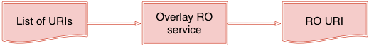
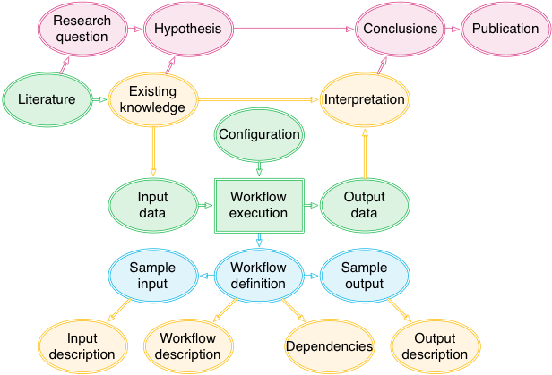
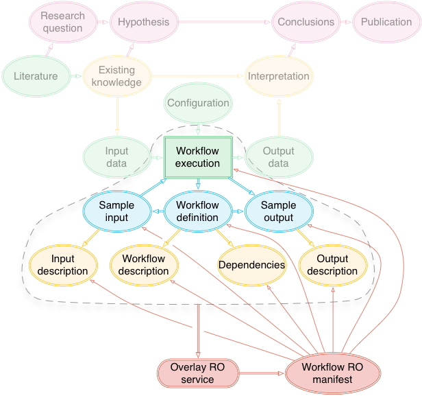
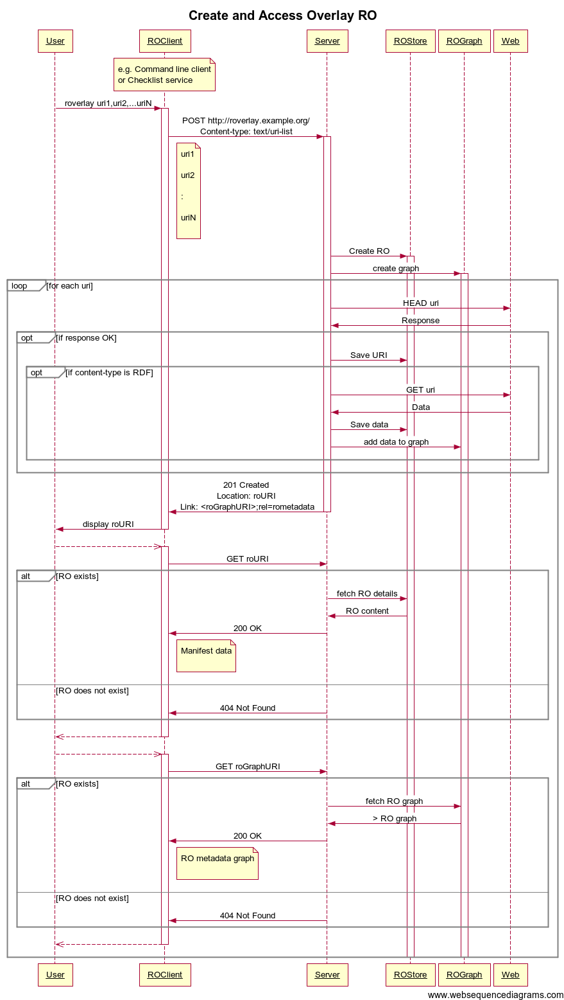

<!-- # roverlay.md -->

# `roverlay`: a service to create Research Object overlays on generic linked data

**Contents**

* General description
* Overlay Research Objects
* A simple example walk-through
* Service API description
* `roverlay` command line client and related utilities
* Example: checklist evaluation of chembox data
* Installation
* Persistence of created Research Objects
* Python virtual environments
* Implementation notes

## General description

The Overlay RO service has been created to allow Research Object services, such as the checklist evaluation service, to be used with arbitrary linked data.  It provides a very lightweight mechanism for creating a Research Object structure over existing linked data on the web.

The basic function of the service is very simple:

The service is provided with a list of URIs of linked data resources, and returns the URI of an RO that aggregates those resources (i.e. a URI that, when dereferenced, returns a manifest for the created RO).

## Overlay Research Objects

**What are they, and why do we need them?**

The main body of Wf4Ever work on Research Objects operates primarily on the basis of collecting resources that constitute an RO in a repository, storing annotations in the same repository, and serving both from the repository.  While these ROs can contain references to aggregated external resources and annotations, this is a secondary feature and is not the primary mechanism offered through the interfaces provided.

In contrast to this, an **Overlay RO** has _all_ of its content stored separately on the web, and the function of the Overlay RO service is to create a minimal RO structure that refers to this external content.  This makes the Overlay RO service very lightweight, and Research Objects can be created and/or destroyed very quickly, without copying or indexing the content of their aggregated resources in a repository or other store.

The Research Object structures that are created by the Overlay RO service are:
* an ORE aggregation of the resources
* RO annotation structures are created for resources that contain machine readable descriptions of other resources (i.e. these are also treated as RO annotations as well as aggregated resources).

These descriptions are published in a new RO manifest resource that "represents" the Research Object; i.e., this manifest is returned when the RO URI is dereferenced.

The resource aggregation is constructed very straightforwardly from the supplied list of URIs.

Creating annotations is a little more complicated.  To keep the service interface simple, the API makes no distinction between annotations and other resources.  Instead, the service probes each of the supplied resources, following any HTTP redirects, and determines the available content types.  Any resource that is available in a recognized serialization of RDF (RDF/XML, Turtle and others) is considered to be an annotation on the RO itself, and a corresponding RO annotation structure is created.

Suppose we have a collection of linked data describing some workflow-based experiment:

We can select a subset of these resources to create a Research Object that describes the workflow and its design, e.g. for evaluation against community best practices for the creation and publication of workflow methods:

Similarly, we might create a different Overlay RO that describes the experiment, as supplemental material for a publication of the conclusions reached though its conduct.  Thius, different ROs may easily be created for different purposes.

## A simple example walk-through

This example follows the use of the Overlay RO service to create an RO for performing "chembox" checklist evaluation of a chemical description.  The example here assumes an Overlay RO service deployed at [http://andros.zoo.ox.ac.uk:8000/rovserver/]().  The chemical whose description is to be analyzed is [Tryptoline](http://purl.org/net/chembox/Tryptoline).  The examples here assume that [RO Manager](https://github.com/wf4ever/ro-manager/blob/develop/src/README.md), which provides the `roverlay` command, has been installed on the local computer system.

1. Show summary of `roverlay` command options:

        $ roverlay --help
        usage: 
            roverlay [options] URI [URI ...]    # Create new RO
            roverlay -d ROURI                   # Delete RO
            roverlay -l                         # List available ROs

        Create or display Overlay RO through web service.

        positional arguments:
          URI                   One or more URIs that are aggregated in a created RO

        optional arguments:
          -h, --help            show this help message and exit
          --version             show program's version number and exit
          -d ROURI, --delete ROURI
                                Delete specified RO
          -l, --list            List available ROs art specified service
          -s SERVICEURI, --service-uri SERVICEURI
                                Overlay RO web service to access. Default
                                http://localhost:8000/rovserver/
          --debug               Run with full debug output enabled

        On successful creation of a new RO, its URI is written to standard output.

2. Create a new RO aggregating a single resource, which is the RDF description of the chemical Tryptoline:

        $ roverlay -s http://andros.zoo.ox.ac.uk:8000/rovserver/ http://purl.org/net/chembox/Tryptoline
        http://andros.zoo.ox.ac.uk:8000/rovserver/ROs/44a31e54/

    This is a very simple example, with just one aggregated resource specified.  More resources can be specified by including their URIs in the command line.  (Once an RO has been created, further resources cannot be added.)

    Note that the command responds with a URI for the RO created.  In all subsequent steps of this walkthrough, the actual URI returned must be used in place of `http://andros.zoo.ox.ac.uk:8000/rovserver/ROs/44a31e54/` shown here.  When using in a Unix or Linux `bash` shell, the following command could be used:

        $ RO=`roverlay -s http://andros.zoo.ox.ac.uk:8000/rovserver/ http://purl.org/net/chembox/Tryptoline`

    Then use `$RO` for the URI of the created RO.

3. Examine the created Research Object (subsitute the RO URI returned in the previous step above):

        $ curl http://andros.zoo.ox.ac.uk:8000/rovserver/ROs/44a31e54/
        <html>
        <head>
            <title>Research Object http://andros.zoo.ox.ac.uk:8000/rovserver/ROs/44a31e54/</title>
        </head>
        <body>
        <h1>Research Object http://andros.zoo.ox.ac.uk:8000/rovserver/ROs/44a31e54/</h1>
            <h2>Research Object aggregated resources:</h2>
            

              <ul>
              <li><a href="http://sierra-nevada.cs.man.ac.uk/chembox/Tryptoline">http://sierra-nevada.cs.man.ac.uk/chembox/Tryptoline</a></li>
              </ul>
            

        </body>
        </html>

    Note that default response is an HTML summary of the RO created.  Thus, the RO URI can be used directly in a browser.

4. Obtain a copy of the RO manifest for the created RO (using the RO URI returned):

        $ curl -H "accept: text/turtle" http://andros.zoo.ox.ac.uk:8000/rovserver/ROs/44a31e54/
        @prefix ns1: <http://purl.org/ao/> .
        @prefix ns2: <http://purl.org/wf4ever/ro#> .
        @prefix ns3: <http://www.openarchives.org/ore/terms/> .
        @prefix rdf: <http://www.w3.org/1999/02/22-rdf-syntax-ns#> .
        @prefix rdfs: <http://www.w3.org/2000/01/rdf-schema#> .
        @prefix xml: <http://www.w3.org/XML/1998/namespace> .
        @prefix xsd: <http://www.w3.org/2001/XMLSchema#> .

        <> a ns2:ResearchObject ;
            ns3:aggregates [ a ns2:AggregatedAnnotation ;
                    ns1:body <http://sierra-nevada.cs.man.ac.uk/chembox/Tryptoline> ;
                    ns2:annotatesAggregatedResource <> ],
                <http://sierra-nevada.cs.man.ac.uk/chembox/Tryptoline> .

    The manifest is obtained by content negotiation for a supported RDF format: at least `application/rdf+xml` and `text/turtle` are supported.  Other formats may be available.

    Note that the manifest here aggregates two resources:
    1. the resource specified in the original `roverlay` command, after following any HTTP redirects associated with the original URI.  (Try entering the command `curl http://purl.org/net/chembox/Tryptoline` to confirm this redirect.)
    2. a blank node that denotes an annotation stub, indicating that the aggregated resource is the body of an annotation of the RO itself.  (The `<>` is a relative reference, based here on the RO URI itself, following the rules of RFC3986.)

5. To show this behaves like an RO, the `ro list` command can be used to list the aggreated resources:

        $ ro list http://andros.zoo.ox.ac.uk:8000/rovserver/ROs/44a31e54/
        http://sierra-nevada.cs.man.ac.uk/chembox/Tryptoline

6. Similarly, `ro dump` can be used to show the content of the annotations:

        $ ro dump http://andros.zoo.ox.ac.uk:8000/rovserver/ROs/44a31e54/
        <?xml version="1.0" encoding="utf-8"?>
        <rdf:RDF
          xmlns:chembox="http://dbpedia.org/resource/Template:Chembox:"
          xmlns:rdf="http://www.w3.org/1999/02/22-rdf-syntax-ns#"
          xmlns:ns1="http://dbpedia.org/property/"
          xmlns:owl="http://www.w3.org/2002/07/owl#"
        >
          <rdf:Description rdf:about="http://purl.org/net/chembox/Tryptoline">
            <chembox:ImageFile>Tryptoline structure.png</chembox:ImageFile>
             :
            <chembox:InChI>1/C11H12N2/c1-2-4-10-8(3-1)9-5-6-12-7-11(9)13-10/h1-4,12-13H,5-7H2</chembox:InChI>
          </rdf:Description>
        </rdf:RDF>

7. Use the `roverlay -l` option to display a list of ROs available at the Overlay RO service:

        $ roverlay -s http://andros.zoo.ox.ac.uk:8000/rovserver/ -l
        http://andros.zoo.ox.ac.uk:8000/rovserver/ROs/44a31e54/

    The same information can be viewed by browsing to the Obverlay RO service URI [http://andros.zoo.ox.ac.uk:8000/rovserver/]()

8. Finally, the RO can be deleted using the `roverlay -d` option:

        $ roverlay -s http://andros.zoo.ox.ac.uk:8000/rovserver/ \
                   -d http://andros.zoo.ox.ac.uk:8000/rovserver/ROs/44a31e54/
        RO http://andros.zoo.ox.ac.uk:8000/rovserver/ROs/44a31e54/ deleted.
        $ roverlay -s http://andros.zoo.ox.ac.uk:8000/rovserver/ -l
        $ 

There is a further example below using a locally installed Overlay RO service in conjunction with the checklist service.

## Service API description

The Overlay RO service provides a simple REST-style API over HTTP, and should be accessible by any cl;iebnt cabable is issuing simple HTTP requests.

In the examples below, lines of data sent by an HTTP client are prefixed with `C:`. Responses sent by the Overlay RO service are prefixed with `S:`.

### Create an Overlay RO

A list of URIs is POSTed, presented as a `text/uri-list` entity, to the Overlay RO service, which responds with status `201 CREATED` and a `Location` header field indicating a URI for the RO thus created:

    C: POST /rovserver/ HTTP/1.1
    C: Host: service.example.org
    C: content-type: text/uri-list
    C:
    C: http://data.example.org/tom
    C: http://data.example.org/dick
    C: http://data.example.org/harry
   
    S: HTTP/1.1 201 CREATED
    S: Location: http://service.example.org/rovserver/ROs/1234abcd/
    S:
    S: <html>
    S: <head>
    S:     <title>roverlay service</title>
    S: </head>
    S: <body>
    S: <h1>roverlay service</h1>
    S:     <h2>New research object created</h2>
    S:     

    S:       URI: http://service.example.org/rovserver/ROs/1234abcd/
    S:     

    S: </body>
    S: </html>

<!--
curl -v -X POST -H "content-type: text/uri-list" \
         -\-data-binary @- \
         http://localhost:8000/rovserver/ <<EOF
http://data.example.org/tom/
http://data.example.org/dick
http://data.example.org/harry
EOF
-->

### Access an Overlay RO

A previously created Overlay RO can be accessed according to the read-only elements of the RO API (http://www.wf4ever-project.org/wiki/display/docs/RO+API+6), using an HTTP GET or HEAD request:

    C: GET /rovserver/ROs/1234abcd/ HTTP/1.1
    C: Host: service.example.org
    C: Accept: text/turtle
 
    S: HTTP/1.0 200 OK
    S: Content-Type: text/turtle
    S: 
    S: @prefix ns1: <http://www.openarchives.org/ore/terms/> .
    S: @prefix rdf: <http://www.w3.org/1999/02/22-rdf-syntax-ns#> .
    S: @prefix rdfs: <http://www.w3.org/2000/01/rdf-schema#> .
    S: @prefix xml: <http://www.w3.org/XML/1998/namespace> .
    S: @prefix xsd: <http://www.w3.org/2001/XMLSchema#> .
    S: 
    S: <> a <http://purl.org/wf4ever/ro#ResearchObject> ;
    S:     ns1:aggregates <http://data.example.org/dick>,
    S:         <http://data.example.org/harry>,
    S:         <http://data.example.org/tom/> .

<!--
curl -v -H "Accept: text/turtle" http://localhost:8000/rovserver/ROs/????/

curl -v -X HEAD -H "Accept: text/turtle" http://localhost:8000/rovserver/ROs/????/
-->

Note, only the manifest can be accessed via this service.  There is no support through the Overlay RO service for returning a zipped copy of the RO, or any other function that requires accessing the RO content.  Given a copy of the manifest, a client should be able to access aggregated content and annotations directly using the same logic that would be used to retrieve them from a Research Object repository.

### Delete an Overlay RO

The HTTP DELETE option can be used to delete a previously created Overlay RO.  The Overlay RO is removed from the service, but the aggregated resources are not affected.

    C: DELETE /rovserver/ROs/1234abcd/ HTTP/1.1
    C: Host: service.example.org
    C: Accept: */*

    S: HTTP/1.0 204 NO CONTENT

After which, the RO is no longer available:

    C: HEAD /rovserver/ROs/1234abcd/ HTTP/1.1
    C: Host: service.example.org
    C: Accept: text/turtle

    S: HTTP/1.0 404 NOT FOUND
    S: Content-Type: text/html; charset=utf-8

<!--
curl -v -X DELETE http://localhost:8000/rovserver/ROs/????/

curl -v -X HEAD -H "Accept: text/turtle" http://localhost:8000/rovserver/ROs/????/
-->

### List currently available Overlay ROs

A GET to the Overlay RO service URI, requesting a `text/uri-list` entity, returns a list of overlay RO URIs currently available at the service:

    C: GET /rovserver/ HTTP/1.1
    C: Host: service.example.org
    C: accept: text/uri-list
 
    S: HTTP/1.0 200 OK
    S: Content-Type: text/uri-list
    S: 
    S: http://service.example.org/rovserver/ROs/294876ac/
    S: http://service.example.org/rovserver/ROs/294876ad/
    S: http://service.example.org/rovserver/ROs/294876ae/
    S: http://service.example.org/rovserver/ROs/294876af/

<!--
curl -v -H "accept: text/uri-list" http://localhost:8000/rovserver/
-->

## `roverlay` command line client and related utilities

The `roverlay` client provides command line access to the Overlay RO service, and canm be used in conjucntion with other utilities such as RO Manager, `curl`, `asqc`, etc.

For information about `roverlay` options, use the command
    roverlay --help

Implemented features:

    # Create an RO
    roverlay -s http://roverlay.example.org/ uri1 uri2 ... uriN
    http://roverlay.example.org/ROs/id1234/

    # List agregated content of RO
    ro list http://roverlay.example.org/RO/id1234/
    uri1
    uri2
     :
    uriN

    # List available overlay RO URIs at this service:
    roverlay -s http://roverlay.example.org/ -l
     :
    http://roverlay.example.org/ROs/id1234/
     :

    # Remove Overlay RO
    roverlay -d http://roverlay.example.org/ROs/id1234/
    RO http://roverlay.example.org/ROs/id1234/ deleted.

Proposed features, not yet implemented:

    # Get URI for collected annotations
    roverlay -r http://roverlay.example.org/ROs/id1234/ -g
    http://roverlay.example.org/RO_Annotations/id1234/    

    # Get URI for SPARQL endpoint over annotations
    roverlay -r http://roverlay.example.org/ROs/id1234/ -q
    http://roverlay.example.org/RO_Query/id1234/

    # Query SPARQL endpoint
    asq -e http://roverlay.example.org/RO_Query/id1234/ \
        "SELECT * WHERE {http://roverlay.example.org/RO/id1234/ ?p ?o}"
    ...

## Example: checklist evaluation of chembox data

The Overlay RO service has been used to perform checklist evaluation of chembox data hosted by a server at Manchester University.  The sequence here assumes an Overlay RO service running on the local computer.  The logic shown here is used in a script we used to evaluate all chembox chemicals, which can be viewed at [https://github.com/wf4ever/ro-catalogue/blob/master/v0.1/minim-evaluation/chembox_evaluate_rov.sh]().

* Create RO for chemical whose description is to be evaluated:

        $ roverlay -s http://localhost:8000/rovserver/ http://purl.org/net/chembox/Tryptoline
        http://localhost:8000/rovserver/ROs/294876b2/

* Perform checklist evaluation:

        $ curl "http://localhost:8080/evaluate/trafficlight_json\
               ?RO=http://localhost:8000/rovserver/ROs/294876b2/\
               &minim=file:///usr/workspace/wf4ever-ro-catalogue/v0.1/minim-evaluation/chembox-minim-samples.ttl\
               &purpose=complete\
               &target=http://purl.org/net/chembox/Tryptoline"

        { "rouri":                  "http://localhost:8000/rovserver/ROs/294876b2/"
        , "roid":                   "294876b4"
        , "title":                  "294876b4"
        , "description":            "294876b4"
        , "checklisturi":           "http://example.com/chembox-samples/minim_model"
        , "checklistpurpose":       "complete"
        , "checklisttarget":        "http://purl.org/net/chembox/Tryptoline"
        , "checklisttargetlabel":   "http://purl.org/net/chembox/Tryptoline"
        , "evalresult":             "http://purl.org/minim/minim#fullySatisfies"
        , "evalresultlabel":        "fully satisfies"
        , "evalresultclass":        ["pass"]
        , "checklistitems":
          [
            { "itemuri":        "http://example.com/chembox-samples/ChemSpider"
            , "itemlabel":      "ChemSpider is present"
            , "itemlevel":      "http://purl.org/minim/minim#hasShouldRequirement" 
            , "itemsatisfied":  true
            , "itemclass":      ["pass"]
            },
            { "itemuri":        "http://example.com/chembox-samples/InChI"
            , "itemlabel":      "InChI is present"
            , "itemlevel":      "http://purl.org/minim/minim#hasMustRequirement" 
            , "itemsatisfied":  true
            , "itemclass":      ["pass"]
            },
            { "itemuri":        "http://example.com/chembox-samples/Synonym"
            , "itemlabel":      "Synonym is present"
            , "itemlevel":      "http://purl.org/minim/minim#hasMayRequirement" 
            , "itemsatisfied":  true
            , "itemclass":      ["pass"]
            }
          ]
        }

* Delete RO used:

        $ roverlay -s http://localhost:8000/rovserver/ \
                   -d http://localhost:8000/rovserver/ROs/294876b2/
        RO http://localhost:8000/rovserver/ROs/294876b2/ deleted.

## Installation

The Overlay RO service is packaged as part of the RO Manager, but some additional steps are needed after installing RO Manager to deploy and activate the Overlay RO web service.

The installation assumes that a suitable Python virtual environment is being used for the RO Manager installation.  The same environment should be used for running the Overlay RO server and the command line utilities when both are run on a single machine.  See section below for more information.

1. Install RO-manager as described in [https://github.com/wf4ever/ro-manager/blob/master/src/README.md](https://github.com/wf4ever/ro-manager/blob/master/src/README.md).
This installs all the command line utilities (`ro`, `mkminim` and `roverlay`) and their dependencies,
but does not install the web frameworks needed to run any servioces.

2. Install Django, thus:

        $ pip install django

3. To activate an instance of the Overlay RO service, go to the directory `src/roverlay/roweb` within the installed Python environment.  In the following example, `(pyenv)` is the directory which hosts the Python virtual enviropnement where RO Manager has been installed; other elements of the path will vary with the particular version of python used:

        $ which python
        _pyenv_/bin/python
        $ cd _pyenv_/lib/python2.7/site-packages/ro_manager-0.2.15-py2.7.egg/roverlay/rovweb

    Alternatively, if the RO Manager package has been extracted from github to directory `_workspace_`, then the corresponding source directory may be used; e.g.

        $ cd _workspace_/ro-manager/src/roverlay/rovweb

4. On the very first occasion of running the service, create an instance of the `roverlay` local database: 

        $ python manage.py syncdb

   If asked about creating a superuser account, respond "No".

   If this operation fails with the message "OperationalError: unable to open database file", issue the following command and try again:

        $ mkdir db
        $ python manage.py syncdb

5. Now start the Overlay RO service:

        $ python manage.py runserver 0.0.0.0:8000

6. To confirm the service is running, point a browser to [http://localhost:8000/rovserver/]()

At this point, switch to a new terminal session, activate the Python virtual environment into which RO Manager was installed, and you should be able to run the command:

    roverlay --help

A summary of usage options is displayed.

At this point, the commands listed above are available.  If accessing a service running on the local machine, the `-s ` option can be omitted.  Example:

    $ roverlay res1 res2 res3
    http://localhost:8000/rovserver/ROs/127544b3/
    $ roverlay -l
    http://localhost:8000/rovserver/ROs/127544b3/
    $ ro list http://localhost:8000/rovserver/ROs/127544b3/
    file:///usr/workspace/wf4ever-ro-manager/src/roverlay/res1
    file:///usr/workspace/wf4ever-ro-manager/src/roverlay/res2
    file:///usr/workspace/wf4ever-ro-manager/src/roverlay/res3
    $ roverlay -d http://localhost:8000/rovserver/ROs/127544b3/
    RO http://localhost:8000/rovserver/ROs/127544b3/ deleted.
    $ ro list http://localhost:8000/rovserver/ROs/127544b3/
    Can't access RO manifest (404 NOT FOUND) for srsuri http://localhost:8000/rovserver/ROs/127544b3/
    $ roverlay -l

These commands can be issued with the `-s` option to explicitly specify the Overlay RO service:

    $ roverlay -s http://localhost:8000/rovserver/ res1 res2 res3
    http://localhost:8000/rovserver/ROs/127544b4/
    $ roverlay -s http://localhost:8000/rovserver/ -l
    http://localhost:8000/rovserver/ROs/127544b4/

etc.  This `-s` option can be used to access an Overlay RO service running on another host.

## Persistence of created Research Objects

Research Objects created by the roverlay service are saved in a local on-disk database.  This means that they persist when the service is shut down and restarted.

The database can be re-initialized using the `manage.py` utility used when installing the software to initialize the database and run the server:

    $ python manage.py sqlclear rovserver
    $ python manage.py syncdb
    $ python manage.py runserver

## Python virtual environments

I recommend using a Python "virtual environment" for installing RO Manager and related software.
It allows the software to be installed without root privileges, or to create a temporary
or local copy of the RO Manager installation.
A disadvantage of this approach is that the Python virtual environment must always be activated
in order to run RO Manager or any related services.

The following assumes that Python "virtualenv" is installed (http://pypi.python.org/pypi/virtualenv).

You will need to choose a working directory where the Python virtual 
environment will be created.  We'll call this `$RO_MANAGER`.

Prerequisites are python 2.7 (http://python.org/download/releases/2.7/),
virtualenv (http://pypi.python.org/pypi/virtualenv) and 
pip (http://pypi.python.org/pypi/pip, http://www.pip-installer.org/).

1. Create and activate a Python virtual environment:

        cd $RO_MANAGER
        virtualenv roenv
        source roenv/bin/activate

2. To subsequently revert to the system default Python environment:
   
        deactivate

3. To reactivate the Python virtual environment, or to activate it in a new terminal session:

        source $RO_MANAGER/roenv/bin/activate

    or

        . $RO_MANAGER/roenv/bin/activate

4. To remove a temporary Python virtual environment, including any software that has been installed there:

        deactivate
        rm -rf $RO_MANAGER/roenv

## Implementation notes

### Overlay RO service source code overview

The Overlay RO source code is contained within the RO Manager project source tree:

    +- ro-manager  (top level of github project from https://github.com/wf4ever/ro-manager/)
       |
       +- src
       |  |
       |  +- MiscUtils (miscellaneous supporting utility functions code)
       |  +- iaeval (main checklist evaluation code)
       |  +- rocommand (main RO Mananger code, includes modukles for accessing Research Object)
       |  +- roweb  (web application to service checklist API and invoke the checklist service)
       |  +- checklist (mkminim utility to creare Minim models from spreadsheet description)
       |  +- roverlay (Overlay RO service)
       |  |  |         
       |  |  +- rovcmd (roverlay command line tool)
       |  |  |
       |  |  +- rovweb (Overlay RO web service)
       |  |     +- db (Django database files, including persistence for Overlay ROs)
       |  |     +- rovserver (Overlay RO Django application) 
       |  |     |  |         (in particular, see views.py)
       |  |     |  +- templates (web page Django templates)
       |  |     |  +- tesdata (data for testing)
       |  |     |
       |  |     +- rovweb (Django web server configuration)
       |  |
       |  +- samples (sample code for developmenbt testing)
       |  +- spike (exploratory code snippets)
       |
       +- doc (user documentation for RO Mananger)
       |
       +- Minim (contains ontology for Minim model used to describe checklists)
       |
       +- Checklists (sample checklists used for testing, etc.)

### `roverlay` software framework

The `roverlay` source code is part of the RO Manager project in Github (https://github.com/wf4ever/ro-manager).  The main source code is in subdirectory `/src/roverlay` of that project, and also uses a few modules from `src/rocommand` and `/src/MiscUtils`.  Like RO Manager, the main programming language used is Python.  There are two parts to the `roverlay` code:

1. Directory `/src/roverlay/rovweb` contains a web server application based on Django (https://www.djangoproject.com), the code for which follows normal Django conventions.  The main logic of the Overlay RO web service is in file `/src/roverlay/rovweb/rovserver/views`

2. Directory `/src/roverlay/rovcmd` contains the command line client, `roverlay`, which can be used from shell scripts to invoke the Overlay RO service to create and delete Research Objects.  It uses mostly standard Python library facilities in its operation.  Run this with the `--help` option to see the command options available.

#### Notes:

* roverlay web service based on Django web framework
* POST to create RO
* DELETE to delete RO
* GET, HEAD to access RO using read-only elements of RO API

> The examples above show ideas for graph and SPARQL endpoint options.  These are in anticipation of performance improvements for (say) chembox, and will not be part of the initial implementation.   I have made enquiries about a SPARQL protocol implementation for rdflib that can be used with Django, and responses have been encouragiong but, as yet, untested.

> Subsequent experience with roverlay has shown alternative, very effective ways to overcome the performance issues enountered previously.  At this stage, it is not clear that the additional features will be justified.  The graph facility can be partially provided using the `ro dump` command, and the additional value of a SPARQL endpoint is currently not clear.

### roverlay service interactions

### roverlay deployment plans

The service has been temporarily deployed at andros.zoo.ox.ac.uk for testing, but this is not a production service and may be taken down at any time.

Deployment on the Wf4Ever sandbox has been attempted, but a fully functional service does not exist here because the service does not work seamlessly through a reverse proxy (see below).

### Note about reverse proxy deployment

The roverlay service returns URIs in headers and response bodies that are needed to access the ROs created.  Because of this, the service cannot be run behind a reverse proxy gateway.  For this reason, we have not been able to deploy it in the Wf4Ever sandbox.

For the service to function behind a reverse proxy, the following would need to be handled by the reverse proxy service:

1. Proxy redirects to a public address, not the localhost interface (is this true if the rewrites are all performed as needed?)
2. Location: headers in responses re-written (in principle, Apache's reverse proxy should do this, but in tests we undertook this was not happening)
3. URIs in text/uri-list response bodies rewritten

    and possibly, for the future:

4. (Link: header URIs re-written - not currently needed, but may be for future developments)
5. (URIs in RDF responses (all syntaxes) re-written - this might not be needed if the roiverlay server always returns relative URIs.
6. (URIs in HTML responses re-written - see http://apache.webthing.com/mod_proxy_html/)

An alternative possible approach would be to modify the service to work in conjunction with Apache's `ProxyPreserveHost On` directive, and to use the incoming host as the root for all generated URIs in data and headers.
