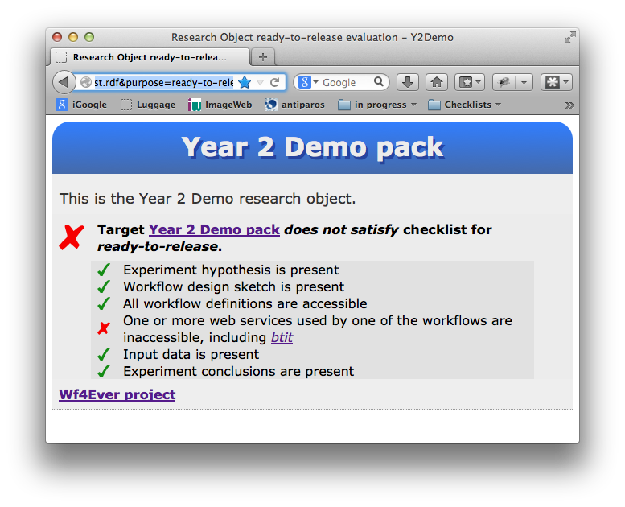

# Research Object checklist evaluation service

**Author: Graham Klyne (graham.klyne@zoo.ox.ac.uk)**

The Research Object checklist evaluation service is a web server that performs checklist evaluation of Research Objects.  See [http://www.wf4ever-project.org/wiki/display/docs/RO+checklist+evaluation+API]() and [http://www.wf4ever-project.org/wiki/display/docs/Checklist+traffic+light+API]() for more details.

## Dependencies

* Python 2.7.x
* Linux/Unix type system.
  This software has not been tested under Windows, but may work.
* The sample scripts and example commands are written to run under `bash`
* Python `pip` utility, or `git`, depending on the installation option used.

## Installation overview

Installation instructions assume a terminal interface and a `bash` command shell.

The first step for installing the checklist service is to install RO Manager.  Then some additional supporting code needs to be installed, and the web service deployed and activated.

In the instructions thatn follow:
* _software_ is the name of a directory where the Python virtual enviroment will be installed.
* _roenv_ is the name of python virtual environmewnt used.  This is also used to name a subdirectory of _software_ that holds the virtual environment files.
* _workspace_ is the name of a workspace directory where the RO Manager software is copied.

### RO Mananger

This is just a summary of the RO Manager installation.  More detailed explanations can be found in [https://github.com/wf4ever/ro-manager/blob/master/src/README.md]().

It is recommended to create and activate a new python virtual environment for running the checklist service, to avoid the possibility of creating problems in the default system installationof Python:

If not already existing, create the new virtual environment:

    cd _software_
    pip install virtualenv
    virtualenv _roenv_

Once created, to activate this environment (using name of enviroment used in the original `virtualenv` command:

    source _roenv_/bin/activate

Install the RO Manager software package from github:

    cd _workspace_
    git clone https://github.com/wf4ever/ro-manager.git ro-manager
    cd ro-manager/src
    python setup.py build
    python setup.py install
    ro-manager-test

### Checklist evaluation web service instalation and deploymemt

First, ensure that the appropriate Python virtual environment is active; e.g.

    source _roenv_/bin/activate

The checklist evaluation service uses the Pyramid web application development framework ([http://www.pylonsproject.org]()), which is installed thus:

    pip install pyramid

To activate the checklist web service, go to the RO Manager source directory and issue the command shown:

    cd _workspace_/ro-manager/src
    source roweb/runroweb.sh

Wait for a couple of seconds, then:

    cat roweb/roweb.log

The log file should be empty.  If it is not, it usually contains error messages about a failure to strart the web service.

At this point, the checklist service should to ready to receive HTTP requests on port 8080.  Try starting a browser on the local machine, and displaying the page at `http://localhost:8080` to confirm this.

## Testing the deployed service

Using a browser on the local machione, browse to:

[http://localhost:8080/evaluate/trafficlight_html?RO=http://sandbox.wf4ever-project.org/rodl/ROs/Y2Demo/&minim=http://sandbox.wf4ever-project.org/rodl/ROs/Y2Demo-test/workflow-experiment-checklist.rdf&purpose=ready-to-release]()

The browser should display a page looking something like this:

<!--

-->

----

 This work is licensed under a <a rel="license" href="http://creativecommons.org/licenses/by/2.0/uk/deed.en_US">Creative Commons Attribution 2.0 UK: England &amp; Wales License</a>.

